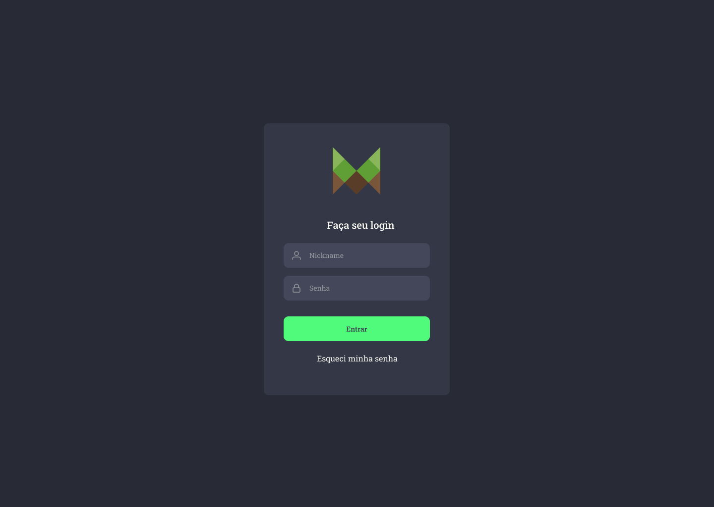
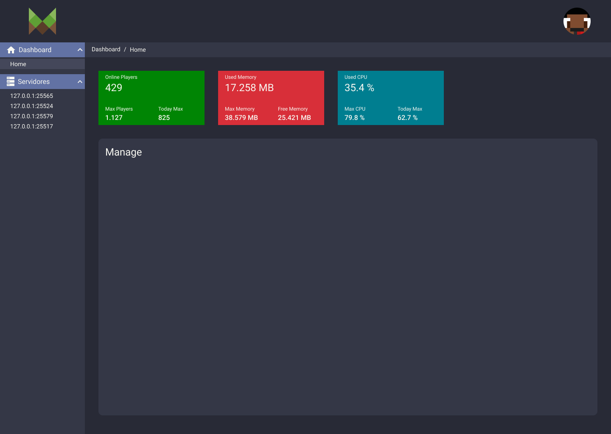
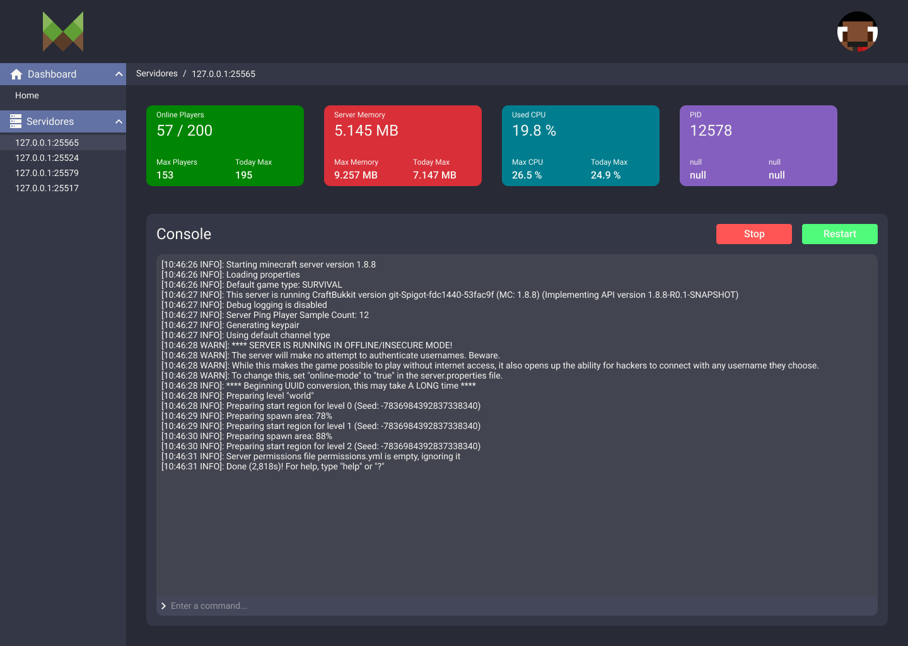

<div align="center">
  
  <br/>

  <b>
    <p>Aplicação desenvolvida para gerenciar aplicações java!</p>
  </b>

  <br/>

<!--  Shields -->
   

  

  
  <a href="https://github.com/filipebsmaia/mpanel/commits/master">
    
  </a>

  <a href="https://github.com/filipebsmaia/mpanel/issues">
    
  </a>

  
<!--  Shields -->
</div>
</br>

# Índice

- [Sobre](#sobre)
- [Layouts](#layout)
- [Tecnologias Utilizadas](#tecnologias)
- [Como Usar](#como-usar)
- [Como Contribuir](#como-contribuir)

<a id="sobre"></a>

## 📖 Sobre

<p>
  Essa aplicação está sendo construída para gerenciar servidores java, está em sua fase inicial.
</p>
<p>

Se você deseja contribuir com este projeto você pode ir ao campo [Como Contribuir](#como-contribuir) para fazer isto!

</p>

<a id="layout"></a>

## 🎨 Layouts

<div align="center">
  
  
  

</div>

<a id="tecnologias"></a>

## 🚀 Tecnologias

O projeto foi desenvolvido utilizando as seguintes tecnologias:

- [TypeScript](https://www.typescriptlang.org/)
- [Node.js](https://nodejs.org/en/)
- [ReactJS](https://reactjs.org/)
- [Express](https://expressjs.com/)
- [TypeORM](https://typeorm.io/)
- [Bcryptjs](https://github.com/kelektiv/node.bcrypt.js/)
- [ClassTransformer](https://github.com/typestack/class-transformer)
- [dotenv](https://github.com/motdotla/dotenv)
- [jsonwebtoken](https://github.com/auth0/node-jsonwebtoken)
- [StyledComponents](https://www.styled-components.com/)
- [uuidv4](https://github.com/thenativeweb/uuidv4)
- [Yup](https://github.com/jquense/yup)

<a id="como-usar"></a>

## 🔎 Como usar

### **Pré-requisitos:**

Para clonar a aplicação você ira precisar do [Git](https://git-scm.com), [Node.js v12.16.3](https://nodejs.org/) ou maior + [Yarn v1.17.3](https://yarnpkg.com/) ou maior instalado em seu computador.
Configurando aplicação:

Lembre-se de acessar a pasta backend e frontend e configurar/criar os seguintes arquivos:

- backend/.env
- backend/ormconfig.json
- frontend/.env

```sh
  # Clone o repósitorio
  $ git clone https://github.com/filipebsmaia/compraszap-hackarocket.git

  ## Instale as dependencias e configurações do backend
  $ cd backend
  $ yarn
  $ yarn typeorm:run
  $ cd ..

  ## Instale as dependencias do frontend
  $ cd frontend
  $ yarn
  $ cd ..

  ## Iniciando aplicação
  $ cd backend
  $ yarn dev
  $ cd ..

  $ cd frontend
  $ yarn start
  $ cd ..

```

<a id="como-contribuir"></a>

## ♻ Como contribuir

- Faça um "Fork" desse repositório,
- Crie uma "branch" com a sua feature: `git checkout -b minha-feature`
- De um "Commit" em suas mudanças: `git commit -m 'feat: Minha incrivel feature'`
- De um "Push" em sua branch: `git push origin minha-feature`

---

<div align="center">
<h4>
    Feito com 💜 por <a href="https://www.linkedin.com/in/filipebsmaia/" target="_blank">Filipe Maia</a>
</h4>
</div>
